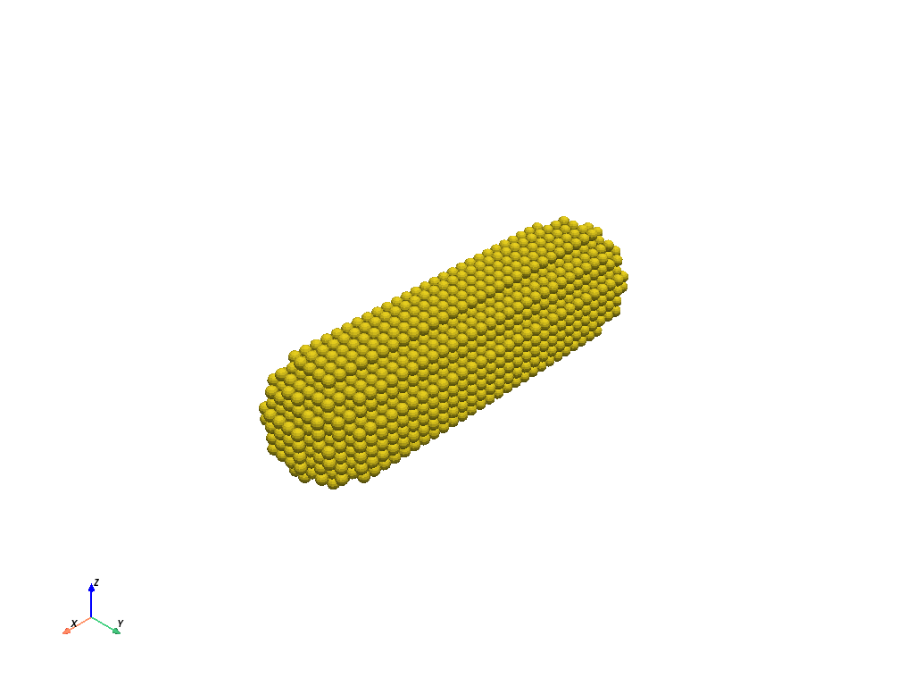
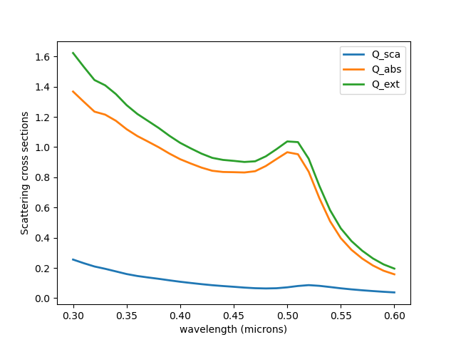

<!-- <a class="reference external image-reference" href="https://gitlab.com/phokaia/pyddscat/-/releases" target="_blank"></a>  -->
<!-- <a class="reference external image-reference" href="https://gitlab.com/phokaia/pyddscat/commits/main" target="_blank"></a>  -->
<!-- <a class="reference external image-reference" href="https://gitlab.com/phokaia/pyddscat/commits/main" target="_blank"></a> -->
<a class="reference external image-reference" href="https://gitlab.com/phokaia/pyddscat/commits/main" target="_blank"></a> 
<a class="reference external image-reference" href="https://gitlab.com/phokaia/pyddscat/commits/main" target="_blank"></a> 
<a class="reference external image-reference" href="https://black.readthedocs.io/en/stable/" target="_blank"></a>
<a class="reference external image-reference" href="https://gitlab.com/phokaia/pyddscat/-/blob/main/LICENSE.txt" target="_blank"></a>


# pyddscat -- A Python interface to DDSCAT

`pyddscat` is a Python package for interfacing to the popular scattering simulator
[DDSCAT](http://www.astro.princeton.edu/~draine/DDSCAT.html). `pyddscat` provides a rich toolset to:

* Create standard `DDSCAT` scattering targets based on physical (rather than dipole dimensions)
* Construct and visualize complex custom scattering targets
* Manage the job parameters found in the `ddscat.par` file
* Organize iterative jobs requiring multiple targets or input parameters
* Script job submission to cluster queue managers
* Maintain profiles and defaults for deployment on platforms other than the local machine
* Load, plot and manipulate `DDSCAT` output tables
* Manage the output from multiple jobs through results collections
* Work with and visualize nearfield results as multidimensional `numpy` arrays
* Suitable for interactive or scripted use


## Installation

You will need a `fortran` compiler, e.g.:

```
mamba install -c conda-forge fortran-compiler
```

Then clone and install locally with `pip`:

```
git clone git@gitlab.com:phokaia/pyddscat.git
cd pyddscat
pip install -e .
```

## Documentation

See [phokaia.gitlab.io/pyddscat](https://phokaia.gitlab.io/pyddscat)

## Examples

See the [example gallery](https://phokaia.gitlab.io/doc/pyddscat/examples)

```python

"""
A simple example
================

Homogeneous, isotropic finite cylinder with hemispherical endcaps.
"""


import os
import numpy as np
import pyddscat as pd
import matplotlib.pyplot as plt


##############################################################################
# Parameters

length = 0.100
radius = 0.020

material = os.path.join(os.path.abspath(os.path.curdir), "Au_evap")
target = pd.targets.CYLNDRCAP(length, radius, d=0.004, material=material)

##############################################################################
# Plot target
target.show()
```


```python
##############################################################################
# Create a job to be run
job = pd.DDscat(target=target)

##############################################################################
# Change the range of calculated wavelengths and ambient index
job.settings.wavelengths = pd.ranges.How_Range(0.300, 0.600, 31)
job.settings.NAMBIENT = 1.0

##############################################################################
# Run the job
job.calculate()

##############################################################################
# Check optical theorem
out = job.output
optical_theorem = out["Q_abs"] + out["Q_sca"] - out["Q_ext"]
print(optical_theorem)
assert np.allclose(optical_theorem, 0, atol=1e-4)

##############################################################################
# Plot
ax = out.plot(["Q_sca", "Q_abs", "Q_ext"])
ax.legend(loc=0)
ax.set_xlabel("wavelength (microns)")
ax.set_ylabel("Scattering cross sections")

```



## Acknowledgement

This project is based on [ScatPy](https://pythonhosted.org/ScatPy/index.html) and has been ported to Python 3.

